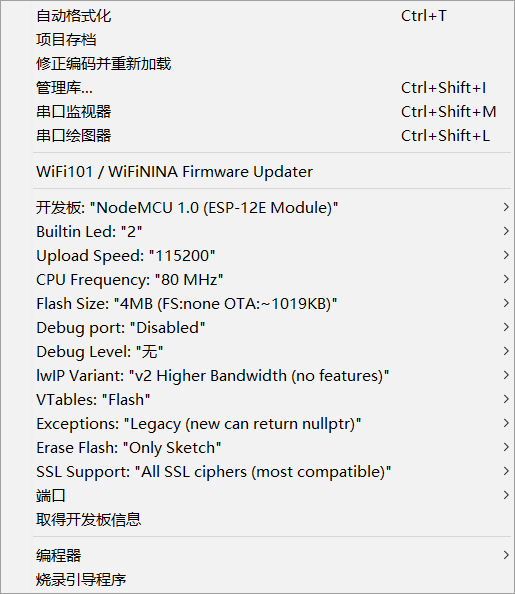
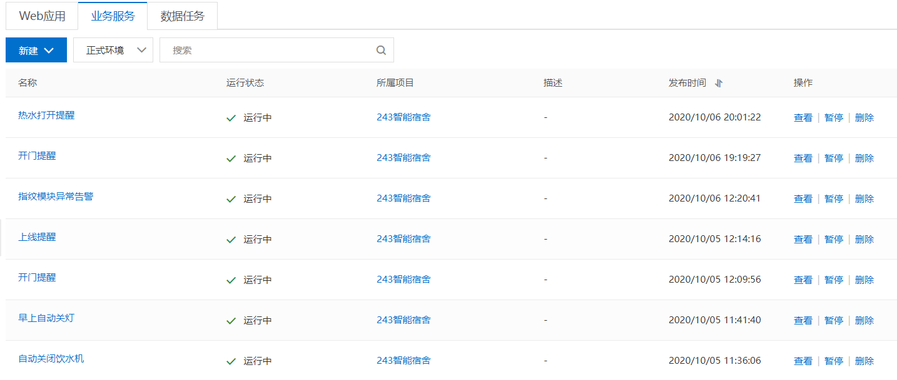
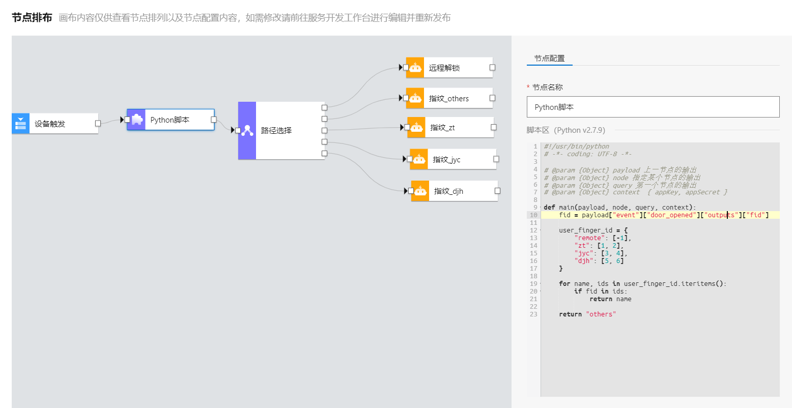
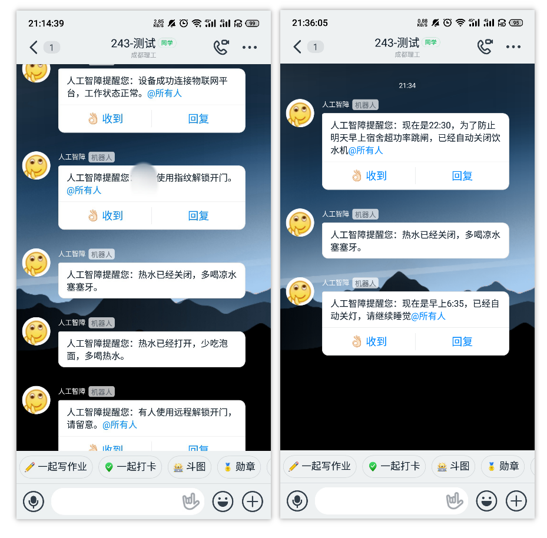
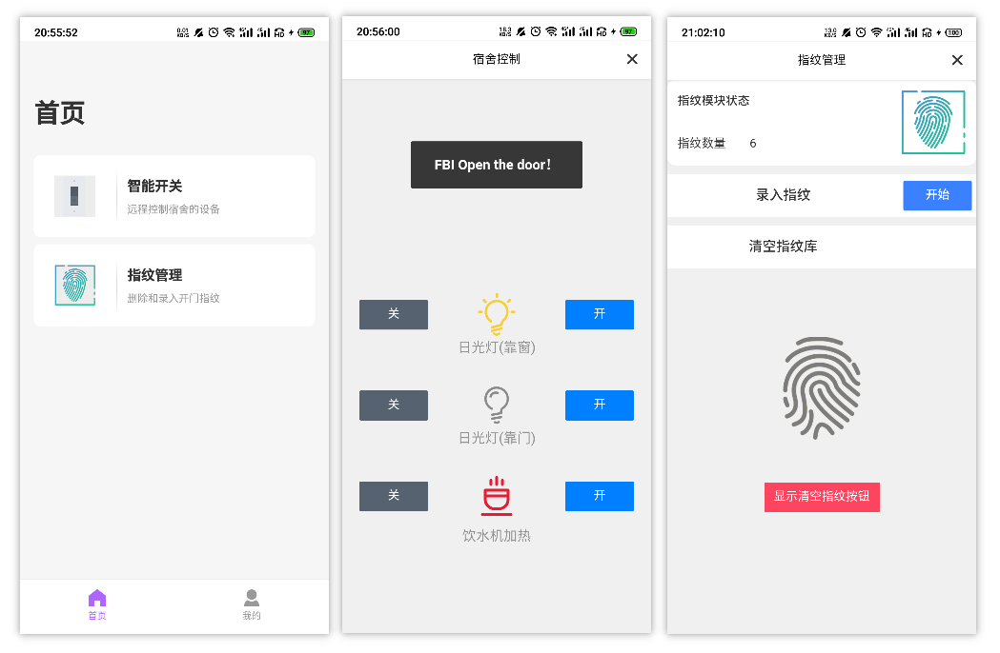

# 物联网宿舍

## 原因

大一上开学那会，时不时有人敲门，开门开到烦了，于是写了这个。

国庆节有空拉出来重写了一波，修复了wifi断开时持续等待配网导致指纹模块无法使用的问题。

## 功能

- APP 远程控制宿舍灯、门、饮水机
- 支持指纹解锁开门
- 钉钉消息推送
- 定时关水、关灯

## 原料

- ESP8266 x1
- MG90s 舵机 x3
- AS608 指纹模块 x1
- 阿里云物联网平台

## 物联网平台配置

- 在`阿里云物联网平台 > 设备管理 > 产品 > 创建产品` 创建一个直连设备，联网方式为 WiFi，数据格式 Alink JSON，认证方式为密钥
- 在 `产品 > 功能定义 > 编辑草稿 > 快速导入` 导入物模型 `model.json` 并发布上线
- 添加一个改产品下的设备，将 `ProductKey` 、`DeviceSecret`、`DeviceName` 填入 `smart_room/config.h`，`REGION` 为服务器位置，默认使用 `cn-shanghai`

## ESP8266 配置

- 将硬件按 `smart_room/config.h` 的注释接到对应 PIN 脚，填上你指纹模块的连接密码(默认是 0)

- Arduino 打开 `smart_room/smart_room.ino`, 烧录至设备。Arduino 需在 `项目 > 加载库 > 管理库` 中安装库 `Adafruit_Fingerprint`、`PubSubClient`，在 `工具 > 开发板 > 开发板管理器` 中安装 esp8266 的支持

- 配置如下

- 直接烧录即可

- 设备上电后，LED持续闪烁，使用 [ESPTouch](https://github.com/EspressifApp/EsptouchForAndroid) 配网。注意手机只能连接 2.4Ghz 的WiFi。填写 WiFi 密码，发送组播或者广播包，等待设备捕获密码并连接网络。
- 若指纹模块异常，LED 将闪烁 3 次并上报云端告警

## 设备调试

- 在`阿里云物联网平台 > 监控运维 > 在线调试 > 调试真实设备` 调试设备属性和调用服务(服务调用没有设置参数)
- 每次云端调用服务如开关灯等，设备响应后会上报硬件状态，在 `设备管理 > 设备 > 设备详情 > 物模型数据` 查看设备的属性值

## APP/Web

- 使用 `阿里云物联网平台 > 相关产品 > IoT Studio` 可快速开发APP和Web程序(虽然很简陋)
- `IoT Stuido > 项目管理 > 项目详情 > 历史功能 > 移动应用开发` 进行可视化APP开发，或者使用阿里云的SDK开发原生APP
- `IoT Studio > 应用开发 > 业务服务` 创建定时任务触发设备服务，或者接入钉钉实现各种信息提醒(钉钉机器人目前不支持处理回复信息, 只能用来发通知。~~第三方QQ机器人被腾讯打压, 还在观望官方动静~~)

> 可以设置各种业务服务

> 指纹开门时触发提醒(`-1`表示使用APP远程开门, 其它数值表示指纹ID，以此判断用户身份)

> 钉钉的智障机器人

> 使用 IoT Studio 拖出来的 APP 界面

